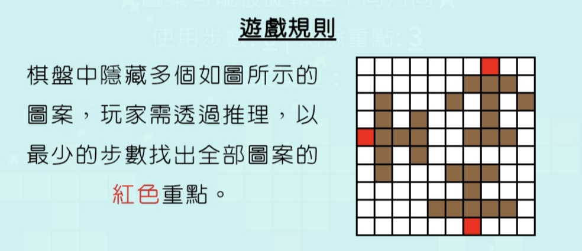

# Find Main Point - A Grid-Based Deduction Web Game


## Overview
Find Main Point is an interactive web-based puzzle game built with HTML, JavaScript, and W3.CSS. Players use logical deduction to uncover hidden patterns' **red key points** on a grid-based board, aiming to find all points in the fewest clicks possible. The game features a customizable grid (default 10x10), and selectable graphics provided (each containing one red key point), all configurable via a settings menu. The responsive design, powered by W3.CSS, ensures a seamless experience across devices.

## Game Rules


- The game board is a grid (default size: 10x10) with hidden patterns.
- Each pattern includes **red key points** that players must locate through logical deduction.
- The objective is to identify all red key points in the **fewest number of clicks**.
- Players interact with the grid by clicking cells to reveal red key points.
- Customize the game via the settings menu to adjust grid size and select from default graphic options, each containing one red key point.

## Features
- **Customizable Grid**: Default 10x10 grid, with user-configurable size in settings.
- **Default Graphic Options**: Select from predefined graphics, each containing one red key point.
- **Interactive Gameplay**: Click grid cells to uncover points.
- **Responsive Design**: Built with W3.CSS for a clean, mobile-friendly interface.
- **Score Tracking**: Track the number of clicks to achieve the best score.
- **Cross-Browser Compatibility**: Works on modern browsers (Chrome, Firefox, Safari, Edge).
- **No Backend Required**: Fully client-side, runs directly in the browser.

## Getting Started

### Prerequisites
- A modern web browser (e.g., Chrome, Firefox, Edge, or Safari).
- No additional software or dependencies required.

### Installation
1. Clone the repository:
   ```bash
   git clone https://github.com/wolf-killer/Find.git
   ```
2. Navigate to the project directory:
   ```bash
   cd Find
   ```
3. Open the game in a web browser:
   - Double-click `index.html` to open it directly (works in browsers like Firefox that allow local file access).
   - For best results, especially in Chrome, host the files using a web server (e.g., VS Code Live Server, or any static file server) and access via `http://localhost`.

## How to Play
1. Open the game by loading `index.html` in a web browser.
2. Access the **Settings** menu to customize:
   - **Grid Size**: Adjust the grid dimensions (default: 10x10).
   - **Graphics**: Choose from default graphic options, each containing one red key point.
3. Click on grid cells to reveal red key points, using deduction to minimize clicks.
4. The game tracks your click count and may display a score.
5. Aim to uncover all red key points efficiently to achieve the best score.

## Project Structure
```
Find/
├── index.html       # Main HTML file for the game
├── css/             # W3.CSS framework and custom styles
├── js/              # JavaScript files for game logic, settings, and interactivity
├── image/           # Image assets for game graphics and themes
└── README.md        # This file
```

## Contributing
Contributions are welcome! To contribute:
1. Fork the repository.
2. Create a new branch (`git checkout -b feature-branch`).
3. Make your changes and commit (`git commit -m "Add new feature"`).
4. Push to the branch (`git push origin feature-branch`).
5. Create a pull request.

Please ensure your code is well-documented, maintains the project's structure, and supports the customizable settings.

## License
This project is licensed under the MIT License. See the [LICENSE](LICENSE) file for details.

## Contact
For questions, bug reports, or suggestions, please open an issue on the [GitHub Issues page](https://github.com/wolf-killer/Find/issues).
